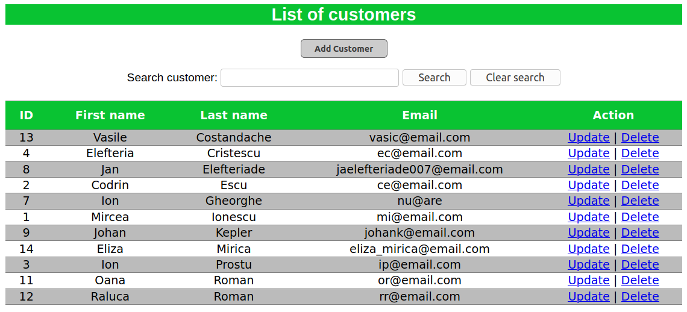

# client-management-webapp

#### Basic info
Simple Spring Boot webapp to track information about customers (CRUD). It includes the ability to search by the client's last name.

#### The app uses
- frontend: HTML, CSS, Thymeleaf template engine
- persistance: PostgreSQL, Spring Data JPA, Hibernate
- build tool: Gradle

#### Database

```sql
CREATE TABLE customers (
	id SERIAL PRIMARY KEY,
	first_name VARCHAR(30),
	last_name VARCHAR(30),
	email VARCHAR(30)
);
```
#### Screenshots

  

Inspired by Chad Darby's tutorial on Udemy.
